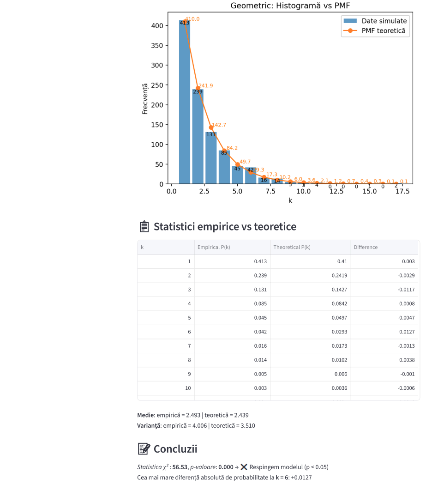

# 🎲 Discrete Distribution Simulator

A clean, interactive **Streamlit** dashboard designed to bridge the gap between probability theory and real-world data. This tool simulates three major discrete distributions, visualizes their behavior, and runs statistical tests to see if the "random" data actually follows the math.

---

## 🛠️ Installation & Setup

Since modern Python environments are "externally managed," it is recommended to use a virtual environment.

1.  **Clone this repository:**
    ```bash
    git clone [https://github.com/yourusername/distribution-simulator.git](https://github.com/yourusername/distribution-simulator.git)
    cd distribution-simulator
    ```

2.  **Create and activate a virtual environment:**
    * **Linux/macOS:**
        ```bash
        python3 -m venv .venv
        source .venv/bin/activate
        ```
    * **Windows:**
        ```bash
        python -m venv .venv
        .venv\Scripts\activate
        ```

3.  **Install dependencies:**
    ```bash
    pip install streamlit numpy pandas matplotlib scipy
    ```

4.  **Run the application:**
    ```bash
    streamlit run app.py
    ```



